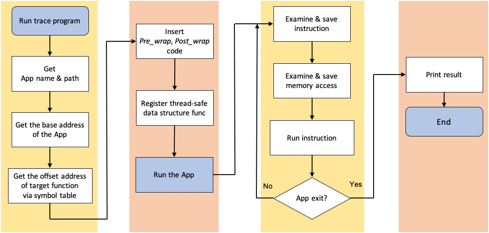

# Function Usage Tracer

It traces the specific function of any executable.

This tool is modified from DynamoRIO's sample code: `instrace_simple.c`, `memtrace_simple.c`

## Features

- Trace the memory access
- Trace the instruction
- Thread safe

## Examples

Run the tracer and the target function name in `a.out` is `my_target_func`.

```bash
$ ~/dynamorio/bin64/drrun -c ~/dynamorio/trace_target_func_usage/build/libtrace_target_func_usage.so my_target_func -- ./a.out
[INFO] Program name: a.out
[INFO] Application path: /tmp/a.out
[INFO] Data file /home/jackkuo/dynamorio/trace_target_func_usage/build/memtrace.a.out.263211.0000.log created
[INFO] App path: /tmp/a.out
[INFO] App path: /tmp/a.out
[INFO] The addr: 4418
[INFO] The module base addr: ELF
[INFO] Target function wrapped @ 0x0000000000001142
~~ Enter Target Function ~~
== Leave Target Function ==
~~ Enter Target Function ~~
== Leave Target Function ==

######################################
######################################
### mem refs seen: 36/73426
### ins exec seen: 26/112078
```

Here is the log file of `memtrace.a.out.263211.0000.log`:

```
# Format: <data address>: <(r)ead/(w)rite/opcode>, <data size>
# Format: <instr address>: <opcode>
~~ Enter Target Function ~~
0x7ffff3dd9146: push, 1
0x7fffffffdef0: w, 8
0x7ffff3dd914a: mov, 3
0x7fffffffdedc: w, 4
0x7ffff3dd914d: mov, 3
0x7fffffffdedc: r, 4
0x7ffff3dd9153: mov, 3
0x7fffffffdee8: w, 4
0x7ffff3dd9156: mov, 3
0x7fffffffdedc: r, 4
0x7ffff3dd915c: mov, 3
0x7fffffffdeec: w, 4
0x7ffff3dd915f: mov, 3
0x7fffffffdeec: r, 4
0x7ffff3dd9162: pop, 1
0x7fffffffdef0: r, 8
0x7ffff3dd9163: ret, 1
0x7fffffffdef8: r, 8
0x7ffff3dd9146: push
0x7ffff3dd9147: mov
0x7ffff3dd914a: mov
0x7ffff3dd914d: mov
0x7ffff3dd9150: sub
0x7ffff3dd9153: mov
0x7ffff3dd9156: mov
0x7ffff3dd9159: sub
0x7ffff3dd915c: mov
0x7ffff3dd915f: mov
0x7ffff3dd9162: pop
0x7ffff3dd9163: ret
0x7ffff3dd918a: mov
== Leave Target Function ==
~~ Enter Target Function ~~
0x7ffff3dd9146: push, 1
0x7fffffffdef0: w, 8
...
```

## TODO

- [x] Thread-safe
- [x] Memory access record
- [x] Target function
- [x] .symtab lookup
- [ ] Support multi-function wrap
- [x] Instruction record
- [x] Set target function from cmd line

## Build

Please clone the DynamoRIO from GitHub, instead of downloading the released version, or you may miss some symbol while compiling.

```bash
# build DynamoRIO
git clone https://github.com/DynamoRIO/dynamorio.git
cd dynamorio
git checkout 030f6e4593
cmake .
make -j4

# build this tool
mkdir trace_target_func_usage
cp -r ALL_THE_FILE_IN_THIS_DIR trace_target_func_usage
cd trace_target_func_usage
mkdir build
cd build
cmake ../
make

# and you should find "libtrace_target_func_usage.so" in build/
```

It works well with DynamoRIO version 8.0.1 (030f6e45933816ecb3517ae286d10d12b0864362).

## Run

```bash
# In the DynamoRIO root dir
./bin64/drrun -c trace_target_func_usage/build/libtrace_target_func_usage.so -- YOUR_EXECUTABLE
```

## Customize

- `MAIN_TRACE_INS`
    - Enable instruction trace
- `MAIN_TRACE_MEM`
    - Enable memory trace
- `TARGET_FUNC_NAME`
    - The target function name to trace.
    - If the symbols of executable is [stripped](https://linux.die.net/man/1/strip), this function will NOT work.
- `MAX_RECORD_TIME`
    - The maximum times to write to log file when the target function is called (per thread only).
    - If set to -1, no limit

## Release Notice

`drutil_expand_rep_string` has been comment out since it causes **SIGSEGV** while tracing instructions.

For more detail, please refer to https://github.com/DynamoRIO/dynamorio/issues/4138

## Flowchart



## MISC

- [中文教學](https://jackkuo.org/post/dynamorio_introduction/)

